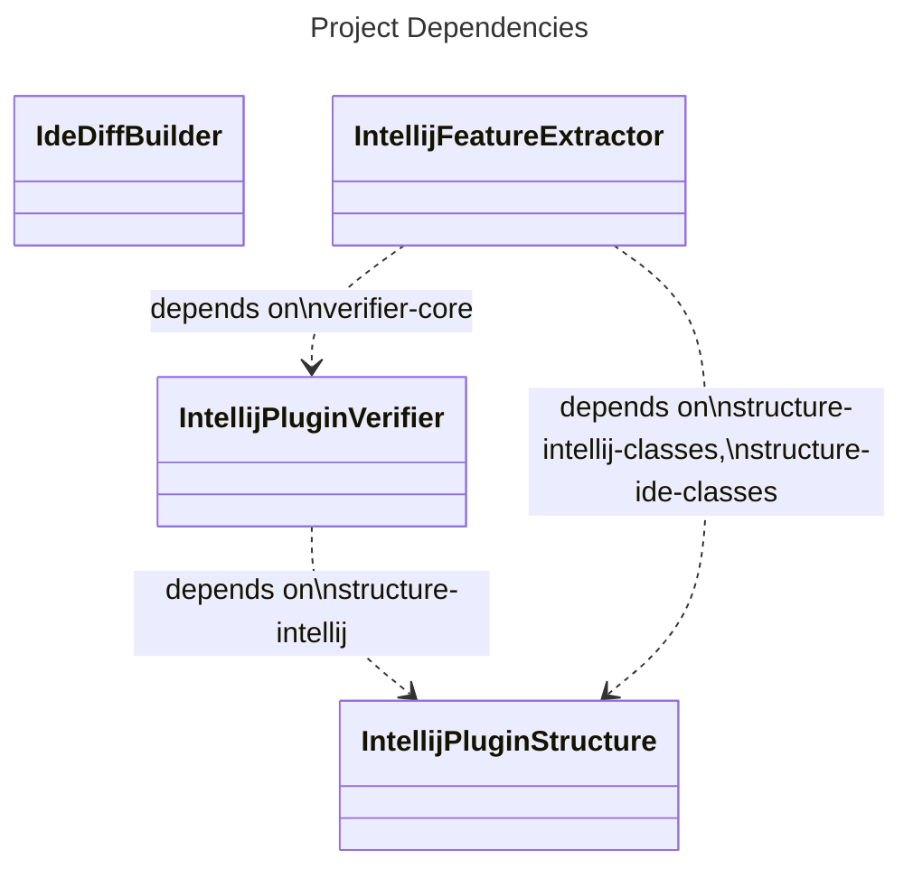

#### Git repository content

This GitHub [repository](https://github.com/JetBrains/intellij-plugin-verifier/) holds the following active projects:
1) [intellij-plugin-structure](intellij-plugin-structure) - API for working with the IntelliJ Plugins and IntelliJ IDEs:
   reading the plugins' descriptors (_plugin.xml_ files), reading class files, verifying the plugins' structures.

2) [intellij-plugin-verifier](intellij-plugin-verifier) - a bytecode verification library used to verify the API binary compatibility of IntelliJ plugins and IDE builds.

3) [intellij-feature-extractor](intellij-feature-extractor) - a library used to extract the plugins' additional features, such as supported file extensions, configuration types etc.
4) [ide-diff-builder](ide-diff-builder) - module that evaluates API difference between IDE releases and builds external annotations `@ApiStatus.AvailableSince` and `@ApiStatus.ScheduledForRemoval`.

Deprecated projects:

4) [plugins-verifier-service](plugins-verifier-service) (`plugins-verifier-service/README.md`). 
This project has been superseded by another implementation.
The only used feature is `org.jetbrains.plugins.verifier.service.service.features.FeatureExtractorService`
referenced by JetBrains Marketplace project.

    Originally, this was an HTTP server responsible for:
   * Running the _intellij-plugin-verifier_ tool for plugins from the JetBrains Plugin Repository against a set of predefined IDEs and sending the verification results for storage to the repository.
   * Running the _intellij-feature-extractor_ for plugins and sending the extracted features to the repository.

#### Dependencies between the projects

The dependencies between the above projects are as follows:

- `ide-diff-builder` -- independent module
- `intellij-plugin-structure` -- independent module
- `intellij-plugin-verifier` -- depends on the:
  * `intellij-plugin-structure` (module `structure-intellij`)
- `intellij-feature-extractor` -- depends on the:
  * `intellij-plugin-verifier` (module `verifier-core`)
  * `intellij-plugin-structure` (modules `structure-intellij-classes` and `structure-ide-classes`)

Deprecated projects dependencies:

- `plugins-verifier-service` -- composite build dependency on:
  * `intellij-feature-extractor`,
  * `intellij-plugin-verifier` (module `verifier-intellij`)

#### Configuring the local environment

Import the **plugins-verifier-service** module as root. IDEA must automatically import other modules using the Gradle Composite Builds feature.

Optionally, import the **ide-diff-builder** module.
