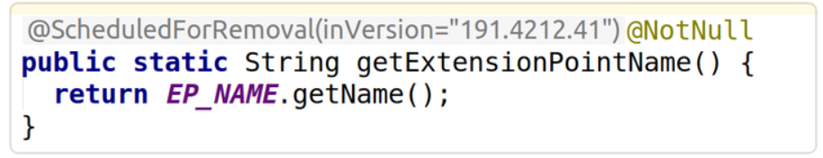
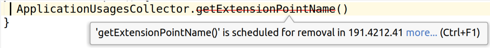
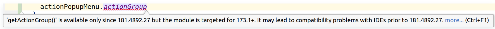

### IDE diff builder
Tool used to build history of IntelliJ API changes.
The core logic can compare two IDE builds and output APIs that were added and removed in the newer build compared to the older build.
By building diffs between adjacent IDE builds the tool generates a `metadata.json` where for each API it is known when (build number) the API was added, marked deprecated or removed.

By `metadata.json` this tool builds [external annotations](https://www.jetbrains.com/help/idea/external-annotations.html) containing:
- `@org.jetbrains.annotations.ApiStatus.AvailableSince(version = X)` where `X` is the version in which the API was added
- `@org.jetbrains.annotations.ApiStatus.ScheduledForRemoval(inVersion = X)` where `X` is the version in which the API was removed
- `@org.jetbrains.idea.devkit.inspections.missingApi.DeprecatedSince(sinceVersion = X)` where `X` is the version in which the API was marked deprecated.

These external annotations are automatically downloaded by IDE and attached to plugin project to show additional info for plugin authors.
- highlight when API will be removed

- produce warnings on usages of APIs that will be removed in a later release  

- produce warnings on usages of APIs that were not available in earlier IDE builds

  
### How it works
- [Build API Annotations](https://buildserver.labs.intellij.net/buildConfiguration/ijplatform_Service_PluginVerifier_BuildApiAvailableSinceData) configuration downloads all publicly visible IDE builds from https://www.jetbrains.com/intellij-repository/releases
and runs the `ide-diff-builder` tool for every adjacent IDE builds to generate `metadata.json` and external annotations like `ideaIU-211.123-annotations.zip`
- [Upload releases to maven repository](https://buildserver.labs.intellij.net/admin/editBuild.html?id=buildType:ijplatform_Service_UploadReleasesToMavenRepository) configuration uploads IDE builds from the Installers along with the external annotations
- DevKit IntelliJ Plugin integrates with `Gradle` to automatically attach external annotations to libraries containing IntelliJ APIs ([IdeExternalAnnotationsLocationProvider](https://github.com/JetBrains/intellij-community/blob/master/plugins/devkit/devkit-core/src/inspections/missingApi/resolve/IdeExternalAnnotationsLocationProvider.kt))
- IDE provides an [inspection](https://github.com/JetBrains/intellij-community/blob/master/jvm/jvm-analysis-impl/src/com/intellij/codeInspection/ScheduledForRemovalInspection.java) for `@ApiStatus.ScheduledForRemoval`, which highlights usages of "scheduled-for-removal" APIs as usages of deprecated APIs
- IDE provides an [inspection](https://github.com/JetBrains/intellij-community/blob/master/plugins/devkit/devkit-core/src/inspections/missingApi/MissingRecentApiInspection.kt) for `@ApiStatus.AvailableSince`, which highlights usages of APIs that were introduced only recently but the plugin is targeting old IDE builds where these APIs were not present
